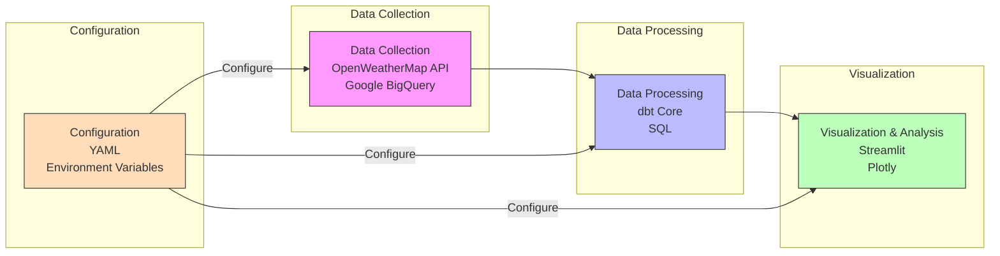
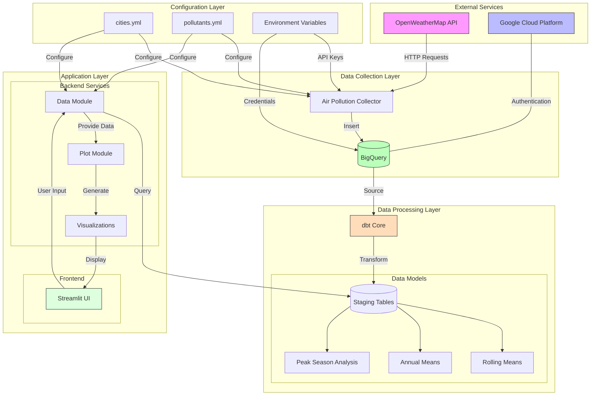
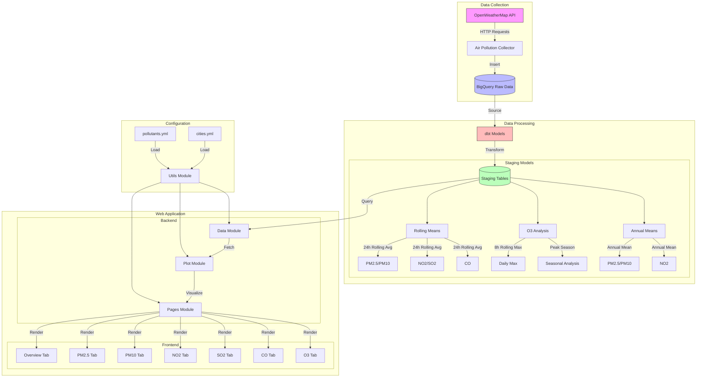

# Air Pollution Dashboard

A comprehensive dashboard for visualizing and analyzing air pollution data across multiple cities.

## Features

- Historical air pollution data collection from OpenWeatherMap API
- BigQuery data storage
- Data transformation using dbt
- Interactive visualizations with Plotly and Streamlit
- Multiple pollutant analysis:
  - PM2.5 and PM10
  - NO2 and SO2
  - CO
  - O3 (including peak season analysis)
- WHO Air Quality Guidelines reference
- Data quality metrics
- Configurable cities and pollutant parameters
- CI/CD pipeline with Github Actions

## Installation

1. Create and activate virtual environment:
```bash
python -m venv .venv
source .venv/bin/activate  # Unix/macOS
.venv\Scripts\activate     # Windows
```

2. Install the package:
```bash
pip install -e ".[dev]"
```

3. Set up environment variables:
```bash
OPENWEATHERMAP_API_KEY=your_api_key
GOOGLE_APPLICATION_CREDENTIALS=path/to/credentials.json
BIGQUERY_PROJECT_ID=your_project_id
```

4. Configure cities in two locations:
- `air_pollution_analytics/seeds/cities.csv`
- `config/cities.yml`

## Usage

1. Collect data:
```bash
python src/raw_data_collection/main.py
```

2. Run dbt models:
```bash
cd air_pollution_analytics
dbt run
```

3. Launch dashboard:
```bash
streamlit run src/web_app/app.py
```

## Architecture Overview

### High-Level Architecture



### Detailed System Architecture



### Component Architecture



## Project Structure

```
air-pollution-dashboard/
├── .github/
│   └── workflows/
│       ├── daily-etl.yml          # Daily data collection pipeline
│       └── dbt-test.yml           # dbt testing pipeline
│
├── air_pollution_analytics/        # dbt project
│   ├── models/
│   │   └── staging/
│   │       ├── stg_annual_mean.sql
│   │       ├── stg_rolling_24h_mean.sql
│   │       ├── stg_o3_8h_rolling.sql
│   │       └── stg_o3_peak_season.sql
│   ├── seeds/
│   │   └── cities.csv             # Reference data for cities
│   ├── dbt_project.yml
│   └── profiles.yml
│
├── config/
│   └── cities.yml                 # Cities configuration for data collection
│
├── src/
│   ├── raw_data_collection/
│   │   ├── __init__.py
│   │   ├── air_pollution_collector.py
│   │   └── main.py
│   ├── utils/
│   │   ├── __init__.py
│   │   └── bq_utils.py
│   └── web_app/
│       ├── __init__.py
│       ├── app.py                 # Main Streamlit application
│       ├── data.py               # Data fetching functions
│       ├── plots.py              # Visualization functions
│       └── utils.py              # Utility functions
│
├── .env.example                   # Example environment variables
├── .gitignore
├── LICENSE
├── README.md
├── pyproject.toml                 # Project metadata and dependencies
└── requirements.txt               # Project dependencies
```

Each directory serves a specific purpose:
- `.github/workflows/`: CI/CD pipelines for automated data collection and testing
- `air_pollution_analytics/`: dbt project for data transformation
- `config/`: Configuration files for data collection
- `src/`: Source code organized by functionality
  - `raw_data_collection/`: Scripts for collecting data from OpenWeatherMap
  - `utils/`: Shared utility functions
  - `web_app/`: Streamlit dashboard application

## Data Flow

1. **Data Collection**:
   - Fetches air pollution data from OpenWeatherMap API
   - Stores raw data in BigQuery

2. **Data Processing**:
   - dbt models transform raw data into analysis-ready tables
   - Calculates rolling means, annual averages, and specialized metrics

3. **Visualization**:
   - Streamlit web app fetches processed data
   - Creates interactive charts using Plotly
   - Displays data quality metrics

## License

MIT License
